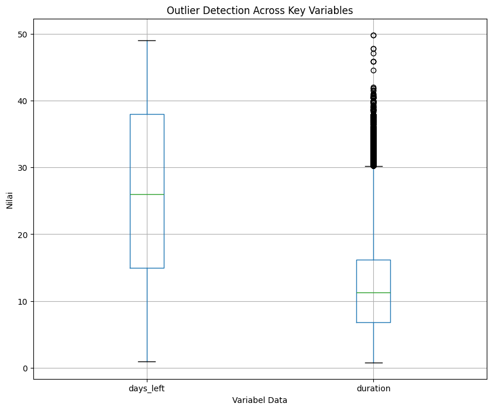

#  📈 Prediksi Harga Tiket Pesawat dengan Linear Regression

## 📝 Deskripsi Proyek
Proyek ini membangun model **Machine Learning** untuk memprediksi harga tiket pesawat berdasarkan berbagai fitur penerbangan. Model dikembangkan menggunakan **Scikit-learn Pipeline** dengan **Linear Regression** sebagai model utama.  

Untuk meningkatkan akurasi pada data harga yang memiliki distribusi miring (*skewed*), target variabel (`price`) ditransformasi secara logaritmik menggunakan **TransformedTargetRegressor (TTR)**.

---

## 🧠 Model dan Pendekatan

Model Linear Regression ini dibangun dengan pipeline yang mencakup:
- **Numerik** → Transformasi log dan standarisasi menggunakan `StandardScaler`
- **Ordinal** → Encoding menggunakan `OrdinalEncoder`
- **Kategorikal** → Encoding menggunakan `OneHotEncoder `
- **Target** → Transformasi log menggunakan `FunctionTransformer` dan `TransformedTargetRegressor`
- Pada fitur numerik (X), log transform dilakukan agar distribusi data lebih normal dan mengurangi skewness.
- Pada target (y), log transform dilakukan melakukan menggunakan `TransformedTargetRegressor` untuk menormalkan harga tiket (price) dan memperkuat hubungan linear antara fitur dan target.

Pipeline ini memastikan proses transformasi dan prediksi dapat berjalan secara *end-to-end*

---

## 🚀 Fitur Utama

### 1. Arsitektur Pipeline
- Seluruh preprocessing (encoding, scaling, ordinal) dan model dibungkus dalam `Pipeline`.
- Menjamin data latih dan data baru diproses identik → mencegah *data leakage*.

### 2. Transformasi Target
- Target `price` ditransformasi dengan `np.log1p` saat training.
- Hasil prediksi dikembalikan ke skala asli dengan `np.expm1`.
- Membantu model menghadapi distribusi harga yang sangat bervariasi.

### 3. Preprocessing Fitur

| Jenis Fitur              | Contoh               | Teknik Transformasi  |
|---------------------------|----------------------|----------------------|
| **Kategorikal Ordinal**  | `class` (Economy/Business) | `OrdinalEncoder` |
| **Kategorikal Nominal**  | `source_city`, `departure_time`, `destination_city`,`stops`, `arrival_time` | `OneHotEncoder` |
| **Numerik**              | `days_left` | `StandardScaler` |

---

## 📈 Hasil Kinerja (Data Uji)

| Metrik | Nilai | Interpretasi |
|--------|-------|--------------|
| **R-squared (R²)** | 0.8489 | Model menjelaskan >84% variasi harga tiket |
| **MAE** | 4912.04 | Rata-rata prediksi meleset tanpa kuadrat ≈ 4.912 |
| **RMSE** | 8826.69 | Kesalahan rata-rata prediksi meleset yang sudah dikuadratkan sekitar 8.826 |

---

## 📊 Visualisasi Data
### 1. Outlier Datasheet
<br>
Ditemukan adanya **outlier** yaitu nilai yang jauh berbeda dari mayoritas data. Outlier ini dapat menyebabkan:
- 📉 **Model bias** → prediksi rata-rata jadi terlalu tinggi/rendah
- 📊 **Distribusi miring (skewed)** → membuat error lebih besar pada harga normal
- ⚡ **Training tidak stabil** → terutama untuk algoritma sensitif terhadap distribusi target

Oleh karena itu, setelah prediksi nilai dikembalikan ke skala aslinya menggunakan fungsi expm1. Menerapkan logaritma pada fitur numerik sebelum diskalakan membantu Linear Regression yang sensitif terhadap skala dan distribusi agar lebih stabil.

### 2. Prediksi vs Nilai Aktual
<br>
Visualisasi di atas merupakan Scatter Plot Prediksi vs Nilai Aktual, visualisasi membantu untuk mengerti perilaku model secara intuitif hal yang sering tidak terlihat hanya dari angka metrik. Plot ini menunjukkan seberapa dekat hasil prediksi dengan kenyataan. Semacam uji keakuratan visual, melengkapi metrik Numerik(MAE, RMSE, R2). Jika R2 mendekati 1 dan titik berjejer di sekitar garis merah -> Model bagus.
Interpretasi hasil:
- Kalau titik-titik biru banyak yang menempel di garis merah, berarti model prediksi sangat akurat.
- Titik yang jauh dari garis merah = error prediksi yang lebih besar
- Semakin rapat titik ke garis merah -> semakin tinggi nilai R2 (koefisien determinasi)
- Menambahkan nilai R2 di plot, jadi pembaca bisa langsung lihat seberapa baik model menjelaskan variasi data.

### 3. Distribusi Residual Error
<br>
Residual adalah selisih antara nilai aktual dan nilai prediksi. Artinya, seberapa jauh prediksi model dari nilai sebenarnya. Tujuannya adalah mengecek apakah error model terdistribusi secara normal (simetris, tanpa bias besar).
Elemen visualisasi:
1. Histogram (batang warna coral/oranye)
 - Menunjukkan sebaran nilai residual.
 - Semakin tinggi batang -> semakin banyak residual yang nilainya berada pada rentang tersebut.
 - Kalau batang lebih banyak di sekitar 0 -> berarti error kecil dan model cukup baik.
2. Kurva KDE (garis halus melengkung)
 - Fungsinya membantu melihat bentuk distribusi residual. Mirip dari histogram
 - Kalau kurvanya simetris di sekitar 0 -> model tidak bias
 - Kalau melenceng ke kiri/kanan -> model bias (overestimate atau underestimate)
3. Garis Tegak Lurus Merah Putus-Putus(axvline)
 - Titik acuan di 0 (residual = 0)
 - Kalau semua residual jatuh tepat di garis ini, model prediksi = nilai aktual(perfect).
 - Tapi realitannya residual pasti menyebar di sekitar garis ini
 - Garis merah ini dipakai untuk menilai: apakah distribusi residual condong ke kiri/kanan dan seberapa jauh penyebarannya dari nol.

Model yang baik biasanya menghasilkan residual:
- Tersebar di sekitar nol,
- Tidak membentuk pola tertentu,
- Tidak terlalu menyebar jauh
Jadi, dengan grafik ini, kita bisa menilai model sudah cukup baik atau masih perlu perbaikan (dengan feature engineering atau tuning parameter)

Interpretasi hasil:
- Distribusi simetris & berpusat di 0 -> model cenderung tidak bias, prediksi mendekati nilai aktual.
- Distribusi condong ke kiri atau kanan -> ada bias, misalnya model sering overestimate (Residual Negatif atau prediksi terlalu tinggi) atau underestimate (Residual Positif atau prediksi terlalu rendah).
- Distribusi menyebar lebar -> Error prediksi besar, model kurang akurat.
- Distribusi sempit di sekitar 0 -> Prediksi model sangat dekat dengan nilai aktual, model bagus

### 4. Residual vs Nilai Prediksi
<br>
Visualisasi ini menampilkan Residual Plot (Residual vs Predicted Values). Tujuannya untuk mengecek apakah error model terdistribusi secara acak atau ada pola tertentu. Membantu mendeteksi, bias sistematis (model selalu meleset ke satu arah), Heteroskedatisitas (variasi error meningkat pada nilai prediksi besar) dan Nonlinearitas (model tidak cukup fleksibel untuk pola data). Ini adalah visualisasi evaluasi model regresi yang digunakan untuk menilai kualitas prediksi dengan melihat pola error(residual) terhadap nilai prediksi.

Elemen visualisasi:
1. Scatterplot titik hijau (prediksi vs residual)
 - Sumbu X = harga prediksi (y_pred) -> Nilai yang diperkirakan model.
 - Sumbu Y = residual (y_test - y_pred) -> selisih antara nilai aktual dan prediksi
 - Setiap titik = satu data.
2. Garis horizontal merah putus-putus (residual = 0)
 - Menjadi titik acuan:
  - Kalau residual = 0 -> prediksi tepat sama dengan aktual
  - Kalau titik di atas garis -> model underestimate (prediksi terlalu rendah).
  - Kalau titik di bawah garis -> model overestimate (prediksi terlalu tinggi).

Penyebaran acak di sekitar garis 0 -> artinya error tidak bergantung pada nilai prediksi berarti model cukup baik. Pola tertentu (misalnya residual makin besar saat harga makin tinggi)-> ada masalah:
 - Heteroskedastisitas : error semakin besar saat nilai meningkat -> model tidak stabil di data besar
 - Nonlinearitas: Model tidak cukup fleksibel menangkap pola -> hubungan non linear.
 - Bias Sistematis: Model cenderung selalu overestimate atau underestimate.

Interpretasi hasil:
 - Kalau titik-titik terlihat acak, menyebar merata di sekitar 0 -> model sudah oke
 - Kalau titik cenderung membentuk pola busur/ kurva -> mungkin model perlu metode lain (misalnya boosting atau menambah fitur)
 - Kalau sebaran makin melebar di kanan (harga tinggi) -> model kesulitan memprediksi harga 
 
### 5. Fitur Penting
<br>
Visualisasi ini adalah Feature Importance Plot dari Linear Regression, menunjukkan fitur yang paling berpengaruh terhadap prediksi harga tiket dan membantu memahami faktor utama yang mempengaruhi model, misalnya rute, maskapai, durasi, atau waktu keberangkatan

## 🛠️ Cara Menggunakan

### 1. Prasyarat
Install pustaka berikut:
```bash
pip install pandas numpy scikit-learn joblib
```

### 2. Muat & Gunakan Model
```bash
import pandas as pd
import joblib

# Muat model
model_linear = joblib.load("linear_regression_pipeline.pkl")

# Data baru
data_baru = pd.DataFrame({
    "source_city": ["Jakarta"],
    "departure_time": ["Malam"],
    "stops": [0],
    "arrival_time": ["Pagi"],
    "destination_city": ["Bali"],
    "class": ["Business"],
    "days_left": [7],
    "duration": [2.5]
})

# Prediksi harga
prediksi = model_linear.predict(data_baru)[0]
print(f"Prediksi Harga Tiket: Rp {prediksi:,.2f}")
```

## 🔮 Potensi Pengembangan
- Tambah fitur Airlines karena setiap maskapai memiliki harga berbeda.
- Validasi dengan K-Fold CV untuk hasil yang lebih stabil.

## 📘 Catatan
Model ini difokuskan pada interpretabilitas dan kemudahan deployment. Jika membutuhkan performa lebih tinggi dapat dibandingkan dengan model lain seperti **RandomForestRegressor** atau **XGBoos**
