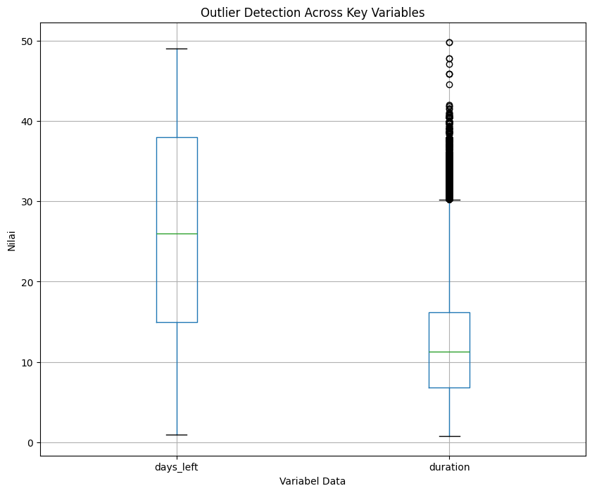

# 🌲 Prediksi Harga Tiket Pesawat dengan Random Forest Regressor

## 📝 Deskripsi Proyek
Proyek ini membangun model **Machine Learning** untuk memprediksi harga tiket pesawat berdasarkan berbagai fitur penerbangan. Model dikembangkan menggunakan **Scikit-learn Pipeline** dengan **Random Forest Regressor** sebagai model utama.  

Untuk meningkatkan akurasi pada data harga yang memiliki distribusi miring (*skewed*), target variabel (`price`) ditransformasi secara logaritmik menggunakan **TransformedTargetRegressor (TTR)**.

---

## 🚀 Fitur Utama

### 1. Arsitektur Pipeline
- Seluruh preprocessing (encoding, scaling, ordinal) dan model dibungkus dalam `Pipeline`.
- Menjamin data latih dan data baru diproses identik → mencegah *data leakage*.

### 2. Transformasi Target
- Target `price` ditransformasi dengan `np.log1p` saat training.
- Hasil prediksi dikembalikan ke skala asli dengan `np.expm1`.
- Membantu model menghadapi distribusi harga yang sangat bervariasi.

### 3. Preprocessing Fitur

| Jenis Fitur              | Contoh               | Teknik Transformasi  |
|---------------------------|----------------------|----------------------|
| **Kategorikal Ordinal**  | `class` (Economy/Business) | `OrdinalEncoder` |
| **Kategorikal Nominal**  | `source_city`, `departure_time`, `destination_city`,`stops`, `arrival_time` | `OneHotEncoder` |
| **Numerik**              | `days_left` | `StandardScaler` |

### 4. Optimasi Hyperparameter
Dilakukan dengan **GridSearchCV** pada parameter utama Random Forest:
- `n_estimators` → jumlah pohon
- `max_depth` → kedalaman maksimum pohon
- `min_samples_split` → jumlah minimum sampel untuk split node

---

## 📈 Hasil Kinerja (Data Uji)

| Metrik | Nilai | Interpretasi |
|--------|-------|--------------|
| **R-squared (R²)** | 0.9422 | Model menjelaskan >94% variasi harga tiket |
| **MAE** | 3043.62 | Rata-rata prediksi meleset ≈ Rp 3.043 |
| **RMSE** | 5452.52 | Kesalahan rata-rata, sensitif terhadap outlier |

---

## 📊 Visualisasi Data
### 1. Outlier Datasheet

Ditemukan adanya **outlier** yaitu nilai yang jauh berbeda dari mayoritas data. Outlier ini dapat menyebabkan:
- 📉 **Model bias** → prediksi rata-rata jadi terlalu tinggi/rendah
- 📊 **Distribusi miring (skewed)** → membuat error lebih besar pada harga normal
- ⚡ **Training tidak stabil** → terutama untuk algoritma sensitif terhadap distribusi target
Oleh karena itu, dilakukan **Transformasi logaritmik pada target (price)** menggunakan `TranformedTargetRegressor`. Hal ini membuat distribusi lebih normal dan model lebih mudah belajar.

### 2. Prediksi vs Nilai Aktual
### 3. Distribusi Residual Error
### 4. Residual vs Nilai Prediksi
### 5. Fitur Penting (Gini Importance)
## 🛠️ Cara Menggunakan

### 1. Prasyarat
Install pustaka berikut:
```bash
pip install pandas numpy scikit-learn joblib
```

### 2. Muat & Gunakan Model
```bash
import pandas as pd
import joblib

# Muat model
best_model = joblib.load("best_flight_predictor.pkl")

# Data baru
data_baru = pd.DataFrame({
    "source_city": ["Jakarta"],
    "departure_time": ["Malam"],
    "stops": [0],
    "arrival_time": ["Pagi"],
    "destination_city": ["Bali"],
    "class": ["Business"],
    "days_left": [7],
    "duration": [2.5]
})

# Prediksi harga
prediksi = best_model.predict(data_baru)[0]
print(f"Prediksi Harga Tiket: Rp {prediksi:,.2f}")
```

## 🔮 Potensi Pengembangan
- Tambah fitur Airlines karena setiap maskapai memiliki harga berbeda.
- Validasi dengan K-Fold CV untuk hasil yang lebih stabil.
- Analisis error per segmen (mis. kelas Business vs Economy).
